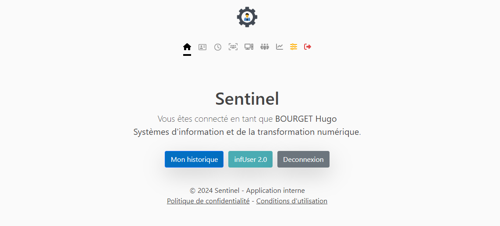
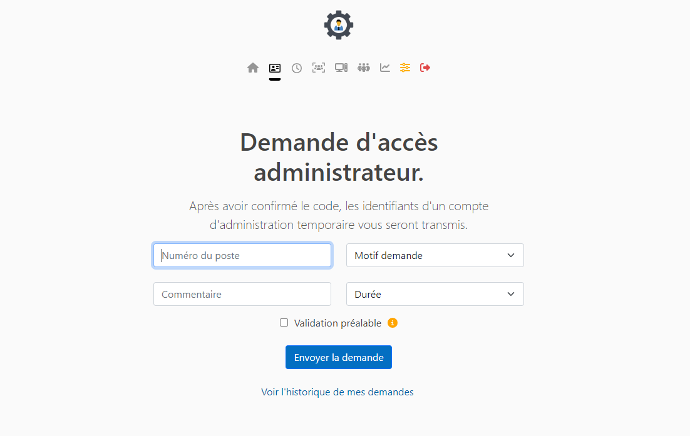
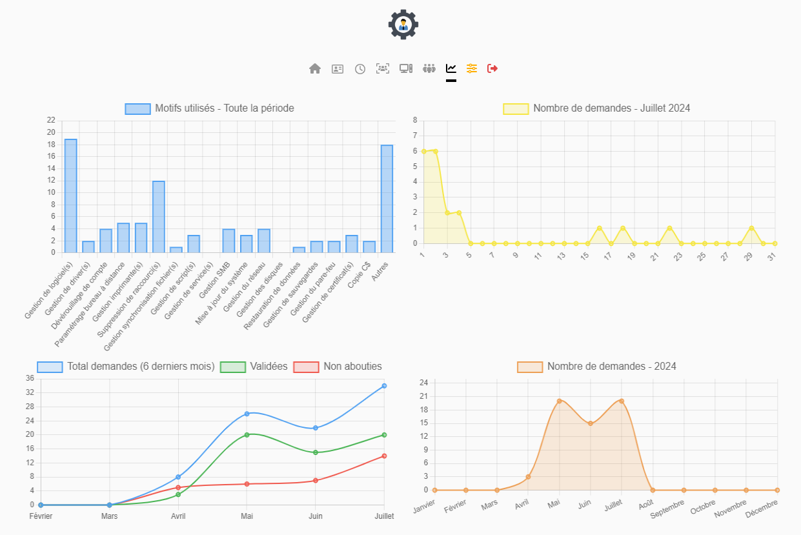
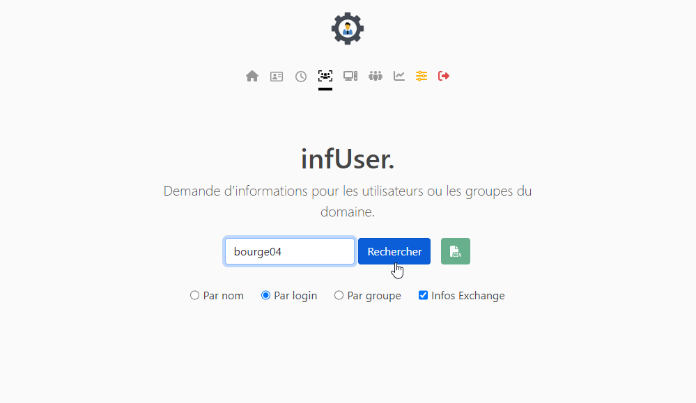
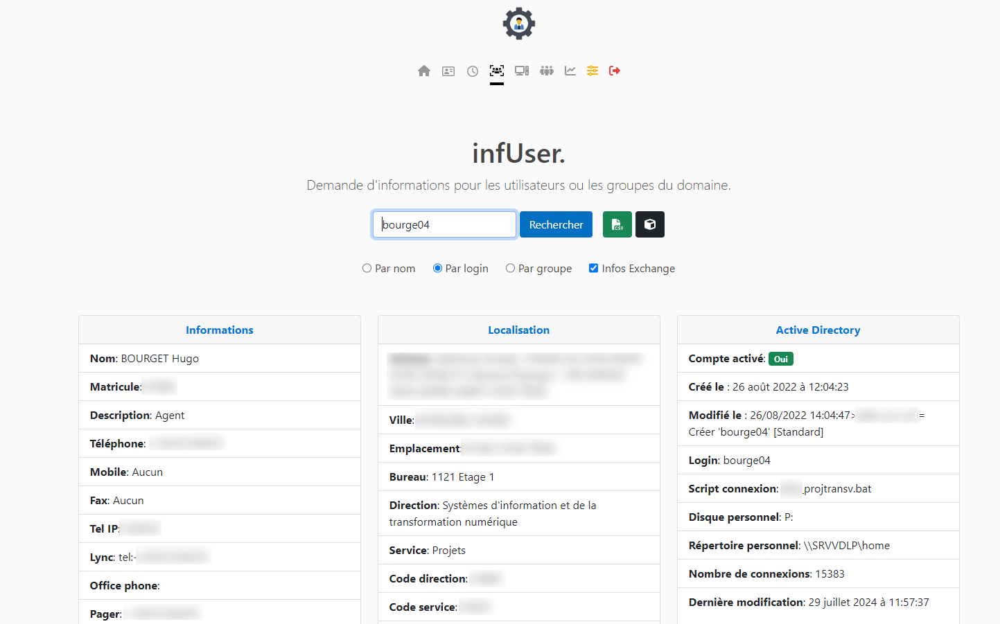
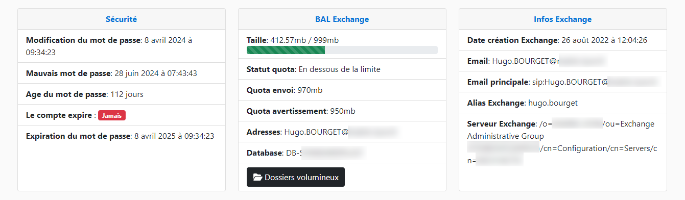
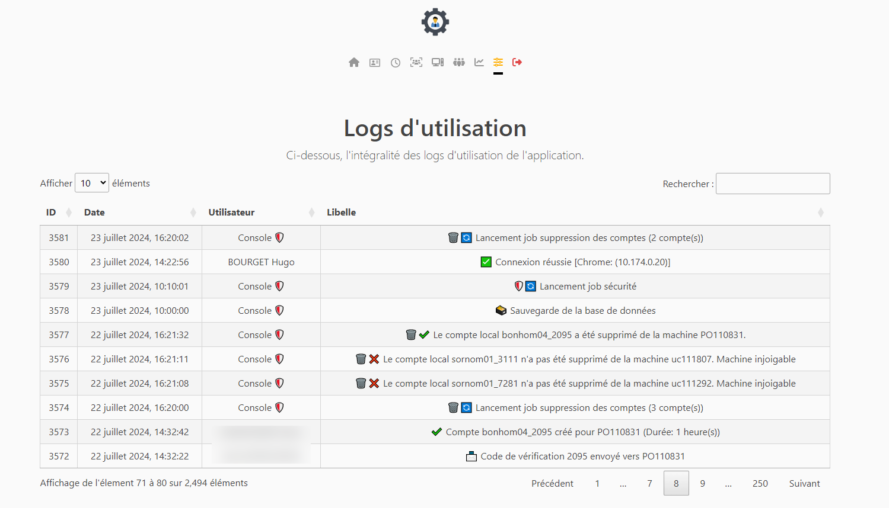
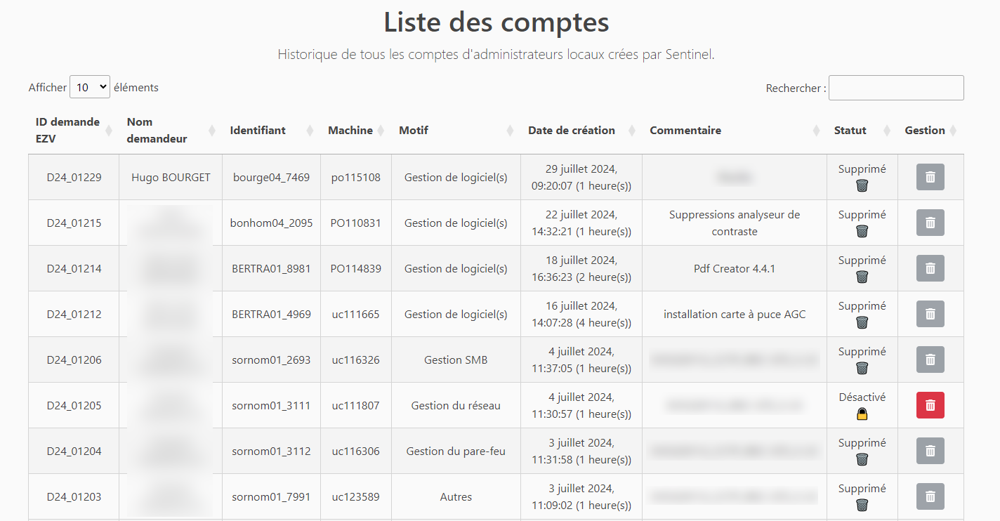
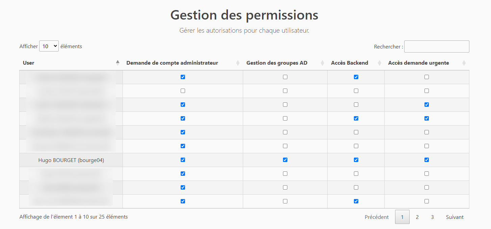

# Sentinel (Due to  NDA, source code is currently private -- subject to change very soon)

Sentinel is a Django-based web application designed for accountable remote management of local administrator accounts on domain-linked computers. This app integrates LDAP, Python, and PowerShell.

## Features

### LDAP Authentication
- Users can securely sign in using their LDAP credentials.

### Secure requesting
- Authorized personnel, based on their LDAP group memberships, can request local administrator access for remote computers.
- Upon request, users need to provide a valid reason and a comment.
- Following the request, a 4-digit verification code is dispatched to the intended machine via a Windows popup.
- The targeted machine's user, upon judging the request genuine, can share this code with the requester.
- Upon successful verification (matching the code), a temporary and personalized local administrator account is established on the target computer.

### Request history
- Authorized users can browse through their successful access request history.

### Privilege escalation monitoring
- Sentinel integrates an algorithm that perpetually monitors for privilege escalations initiated via accounts generated by the application.
- Any unauthorized or suspicious escalation will trigger an alert, with the option to configure email notifications.

### Statistics
- Sentinel provides a comprehensive statistics page highlighting:
- Frequently cited reasons for access requests.
- Trends showcasing the number of accounts instituted over diverse time spans.

### Backend
- A complete backend page enables easy review and management of accounts.

### Logging
- Comprehensive logging ensures that every activity performed on the application is adequately tracked.

# Demo (OLD version)

The app also integrates Grafana & Prometheus support for live monitoring.

